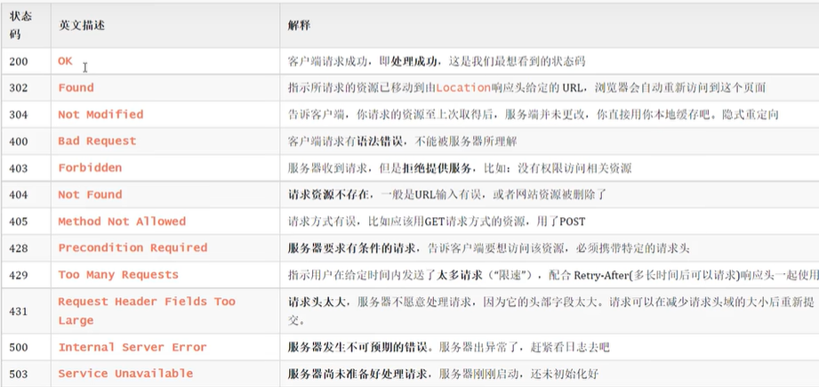

## Web前端开发

### 前端技术

Web标准：

* HTML
* CSS
* JavaScript
  
#### HTML CSS

##### HTML

* 控制页面结构
* 超文本标记语言

##### CSS

* 控制页面样式
* 层叠样式表
  
##### 基础标签和样式

###### 基础标签

* ````图片标签

  * src 指定url
  * url-->绝对路径(绝对磁盘/绝对网络) 
        相对路径(./当前目录  ../上一目录)
  * width 像素/百分比
  * height

* ``<h1>-<h6>``标题标签
* ``<hr>``水平线标签
* ``<a href="(url)" target="_self(当前窗口) (_blank新标签页)"></a>``超链接标签
* ``<video>``视频标签

  * ``src/width/heigth``
  * ``controls``播放插件
  
* ``<audio>``音频标签 
* ``<p>``段落标签
* ``<b>/<strong>``文本加粗
* ``<span>``无语义标签 一行多个 ``<div>`` 一行独个
* ``<table>``表格标签 ``<tr>``行  ``<th>`` 表头单元格 ``<tb>``单元格
  * border 边框宽度
  * cellspacing 单元格之间的空间
* ``<form>``表单标签
  * action url
  * method 提交方式
  * ``<input>``  type
  ``<select>`` ``<textarea>``

###### CSS样式

引入CSS(行内/内嵌(写在head里)/外联)

* 内嵌 ``<style> h1{color: rgb(0,0,0);}</style>``
* 外联 ``<link rel="stylesheet" href="./css/style.css">``

CSS选择器

* 优先级依次++
* 元素选择器
* 类选择器 ``.cls{}``
* id选择器 ``#id {}``

样式

* ``color``颜色 
  ``font-size``字体大小
  ``text-decoration``文本修饰
  ``text-indent``缩进
  ``text-align``属性
* 盒子模型
  ``box-sizing``盒子宽高
  ``padding``内边距
  ``border``边框
  ``margin``外边距上右下左

#### JS

外部脚本 ``<script src="#path"></script>``(不能采取自闭合)

#### 基础语法

* 分号可有可无
* ``window.alert() document.write() console.log()``
* 变量 
  var 可存放不同类型，全局变量，可重复声明
  let 只在相应代码块里有效，不可重复
  const 常量
* 数据类型
  number string boolean null undefined
* 运算符 
  ==会进行类型转换 ===不会
  类型转换 字符串转数字 其他转boolean
* 函数 
  ``function name(a,b)`` 无需参数和返回类型
* JS对象

##### JS对象

* 基础对象
  * Array 
    长度可变 类型可变
    ``forEach()遍历`` ``push()`` ``splice()``
  * String
    ``charAt()`` ``indexOf()检索`` ``trim()去除字符串两边空格`` ``substring()``
  * JSON
    js对象标记法--文本
    ``var a='{"key1":value1}'``
    ``var jso=JSON.parse(a) var jsons=JSON.stringify(jso)``转换
* BOM
  浏览器模型对象
  * Window 浏览器窗口 
    ``alert() confirm() setInterval()周期性执行某个函数 setTimeout()延迟执行``
  * Navigator 浏览器
  * Screen 屏幕
  * History 历史记录
  * Location 地址栏
    ``location.href()``
* DOM
  文档对象模型
  * Document 文档
  * Element 元素
    获取Element元素 ``document.getElementById(); //ByTagName() ByName() ByClassName()``
  * Attribute 属性
  * Text 文本
  * Comment 注释

##### JS事件

事件绑定

* HTML标签中事件属性绑定
* DOM绑定

  ```JavaScript
  document.getElementById('btn').onclick=function(){}
  ```

* 常见事件 事件监听

```JavaScript
  onblur();//元素失去焦点
  onfocus();//获得焦点
  onload();//页面/图像加载完毕
  onsubmit();//表单提交
  onkeydown();
  onmouseover();//鼠标移到
  onmouseout();
```

### 异步交页Ajax

异步的JavaScript和XML
数据交换--异步交互

Axios 封装原生Ajax

### 前端开发框架

#### Vue

基于MVVM模型的js框架
免除原生JavaScript中DOM操作 数据双向绑定

```JavaScript
<script>
  new Vue({
    el:"#id",
    data:{
      url:"path"
    },
    method:{
      a1:function(){}
    }
  })
<script>
```

##### 指令

```JavaScript
v-bind 绑定HTML标签属性值 设置href css等
v-model 表单上创建双向数据绑定
v-on 为HTML标签绑定事件
v-if 条件渲染
v-else-if
v-else
v-show 条件展示
v-for 列表渲染
```

##### 生命周期

八个阶段

```JavaScript
mounted 挂载完成--Vue初始化完成，HTML页面渲染成功--发送请求到服务端 加载数据
```

##### 前端工程化

* YApi--api管理平台
* 环境 vue-cli 脚手架
  依赖环境 nodejs

#### 组件库Element

官方文档cv

* Table
* Pagination 分页
* Dialog
* Form

##### vue路由

url中的hash与组件间的对应关系
Vue Router

##### 打包部署

* build 打包
* Nginx 部署 dist-->nginx/html

```JavaScript
<router-link>
<router-view>
```

---

## Web后端开发

### 项目构建--Maven

* 安装配置(略)
* IDEA集成Maven 配置--创建--导入
  
#### 依赖管理

##### 依赖配置

```java
<dependency></dependency>
```

##### 依赖传递

依赖有传递性

```java
//断开指定依赖
<exclusions></exclusions>
```

##### 依赖范围

```java
//控制依赖作用范围
<scope></scope>
//scope值
compile   主程序 测试 打包 ---log4j
test             测试     ---junit
provided  主程序 测试      ---servlet-api
runtime          测试 打包 ---jdbc
```

##### 生命周期

* clean
* default
  * compile
  * test
  * package
  * install
* site
  
### Web

#### SpringBootWeb

```java
//端口号8080可能会被占用
Application.java-->server.port=8015
```

#### HTTP协议

* 基于TCP协议
* 请求-响应模型
* 无状态协议--请求间不能共享，但速度快

##### 请求协议

请求数据格式

* 请求行
  * 请求方式 资源路径 协议及版本
  * 请求方式：
  * GET:请求参数在请求行，无请求体，有大小限制
  * POST:请求参数在请求体，无大小限制
* 请求头
  * 常见请求头
  * Host 
  * User-Agent 浏览器版本
  * Accept 浏览器能接收的资源类型
  * Accept-Language 
  * Accept-Encoding 浏览器支持的压缩类型
  * Content-Type 请求主体的数据类型
  * Content-Length
* 请求体

##### 响应协议

响应格式

* 响应行
  * 协议 状态码 描述
  * 响应状态码：
  * 1xx 响应中
  * 2xx 成功
  * 3xx 重定向
  * 4xx 客户端错误
  * 5xx 服务器错误
  * 
* 响应头
  * Content-Type 相应内容类型
  * Content-Length
  * Content-Encoding 响应压缩算法
  * Cache-Control 客户端应如何缓存
  * Set-Cookie 所在域设置Cookie
* 响应体

##### 协议解析

繁琐--封装 使用Web服务器

##### Tomcat(略)

SpringBoot已内嵌依赖

#### 请求响应

##### 请求

接口测试--postman Apipost

参数

* 简单参数
  * SpringBoot接收参数
  * 名不一致 手动映射--@RequestParam注释(必须传递参数)
* 实体参数--封装实体类
* 数组集合参数
  * 如前端传回的checkbox 多个参数
  * 数组 ``Array.toString(String[])`` 默认封装到数组
  * 集合 ``@RequestParam List<String>``
* 日期参数
  * 日期参数格式化``@DateTimeFormat(pattern="yyyy-MM-dd") LocalDateTime time)``
* JSON参数
  * 将其封装为实体类 注解``@RequestBody``
* 路径参数
  * 请求路径参数``@RequestMapping("/path/{id}")``
  * 接收路径参数``@PathVariable Integer id``
  
##### 响应

* ``ResponseBody`` 方法返回值直接响应(实体类/集合-->JSON)
``RestController``

* 统一响应结果(返回类型)--封装 ``Result(code,msg,data)``
  全部转为JSON格式数据

##### 分层解耦

* 三层架构 控制层controller--逻辑处理service--数据访问dao
* 分层解耦
  * 高内聚低耦合
  * 解耦合
    * 控制反转 IOC
    * 依赖注入 DI
    * Bean对象
* IOC
* DI

### MySQL
