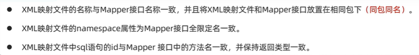

## Web前端开发

### 前端技术

Web标准：

* HTML
* CSS
* JavaScript
  
#### HTML CSS

##### HTML

* 控制页面结构
* 超文本标记语言

##### CSS

* 控制页面样式
* 层叠样式表
  
##### 基础标签和样式

###### 基础标签

* ````图片标签

  * src 指定url
  * url-->绝对路径(绝对磁盘/绝对网络) 
        相对路径(./当前目录  ../上一目录)
  * width 像素/百分比
  * height

* ``<h1>-<h6>``标题标签
* ``<hr>``水平线标签
* ``<a href="(url)" target="_self(当前窗口) (_blank新标签页)"></a>``超链接标签
* ``<video>``视频标签

  * ``src/width/heigth``
  * ``controls``播放插件
  
* ``<audio>``音频标签 
* ``<p>``段落标签
* ``<b>/<strong>``文本加粗
* ``<span>``无语义标签 一行多个 ``<div>`` 一行独个
* ``<table>``表格标签 ``<tr>``行  ``<th>`` 表头单元格 ``<tb>``单元格
  * border 边框宽度
  * cellspacing 单元格之间的空间
* ``<form>``表单标签
  * action url
  * method 提交方式
  * ``<input>``  type
  ``<select>`` ``<textarea>``

###### CSS样式

引入CSS(行内/内嵌(写在head里)/外联)

* 内嵌 ``<style> h1{color: rgb(0,0,0);}</style>``
* 外联 ``<link rel="stylesheet" href="./css/style.css">``

CSS选择器

* 优先级依次++
* 元素选择器
* 类选择器 ``.cls{}``
* id选择器 ``#id {}``

样式

* ``color``颜色 
  ``font-size``字体大小
  ``text-decoration``文本修饰
  ``text-indent``缩进
  ``text-align``属性
* 盒子模型
  ``box-sizing``盒子宽高
  ``padding``内边距
  ``border``边框
  ``margin``外边距上右下左

#### JS

外部脚本 ``<script src="#path"></script>``(不能采取自闭合)

#### 基础语法

* 分号可有可无
* ``window.alert() document.write() console.log()``
* 变量 
  var 可存放不同类型，全局变量，可重复声明
  let 只在相应代码块里有效，不可重复
  const 常量
* 数据类型
  number string boolean null undefined
* 运算符 
  ==会进行类型转换 ===不会
  类型转换 字符串转数字 其他转boolean
* 函数 
  ``function name(a,b)`` 无需参数和返回类型
* JS对象

##### JS对象

* 基础对象
  * Array 
    长度可变 类型可变
    ``forEach()遍历`` ``push()`` ``splice()``
  * String
    ``charAt()`` ``indexOf()检索`` ``trim()去除字符串两边空格`` ``substring()``
  * JSON
    js对象标记法--文本
    ``var a='{"key1":value1}'``
    ``var jso=JSON.parse(a) var jsons=JSON.stringify(jso)``转换
* BOM
  浏览器模型对象
  * Window 浏览器窗口 
    ``alert() confirm() setInterval()周期性执行某个函数 setTimeout()延迟执行``
  * Navigator 浏览器
  * Screen 屏幕
  * History 历史记录
  * Location 地址栏
    ``location.href()``
* DOM
  文档对象模型
  * Document 文档
  * Element 元素
    获取Element元素 ``document.getElementById(); //ByTagName() ByName() ByClassName()``
  * Attribute 属性
  * Text 文本
  * Comment 注释

##### JS事件

事件绑定

* HTML标签中事件属性绑定
* DOM绑定

  ```JavaScript
  document.getElementById('btn').onclick=function(){}
  ```

* 常见事件 事件监听

```JavaScript
  onblur();//元素失去焦点
  onfocus();//获得焦点
  onload();//页面/图像加载完毕
  onsubmit();//表单提交
  onkeydown();
  onmouseover();//鼠标移到
  onmouseout();
```

### 异步交页Ajax

异步的JavaScript和XML
数据交换--异步交互

Axios 封装原生Ajax

### 前端开发框架

#### Vue

基于MVVM模型的js框架
免除原生JavaScript中DOM操作 数据双向绑定

```JavaScript
<script>
  new Vue({
    el:"#id",
    data:{
      url:"path"
    },
    method:{
      a1:function(){}
    }
  })
<script>
```

##### 指令

```JavaScript
v-bind 绑定HTML标签属性值 设置href css等
v-model 表单上创建双向数据绑定
v-on 为HTML标签绑定事件
v-if 条件渲染
v-else-if
v-else
v-show 条件展示
v-for 列表渲染
```

##### 生命周期

八个阶段

```JavaScript
mounted 挂载完成--Vue初始化完成，HTML页面渲染成功--发送请求到服务端 加载数据
```

##### 前端工程化

* YApi--api管理平台
* 环境 vue-cli 脚手架
  依赖环境 nodejs

#### 组件库Element

官方文档cv

* Table
* Pagination 分页
* Dialog
* Form

##### vue路由

url中的hash与组件间的对应关系
Vue Router

##### 打包部署

* build 打包
* Nginx 部署 dist-->nginx/html

```JavaScript
<router-link>
<router-view>
```

---

## Web后端开发

### 项目构建--Maven

* 安装配置(略)
* IDEA集成Maven 配置--创建--导入
  
#### 依赖管理

##### 依赖配置

```java
<dependency></dependency>
```

##### 依赖传递

依赖有传递性

```java
//断开指定依赖
<exclusions></exclusions>
```

##### 依赖范围

```java
//控制依赖作用范围
<scope></scope>
//scope值
compile   主程序 测试 打包 ---log4j
test             测试     ---junit
provided  主程序 测试      ---servlet-api
runtime          测试 打包 ---jdbc
```

##### 生命周期

* clean
* default
  * compile
  * test
  * package
  * install
* site
  
### Web

#### SpringBootWeb

```java
//端口号8080可能会被占用
Application.java-->server.port=8015
```

#### HTTP协议

* 基于TCP协议
* 请求-响应模型
* 无状态协议--请求间不能共享，但速度快

##### 请求协议

请求数据格式

* 请求行
  * 请求方式 资源路径 协议及版本
  * 请求方式：
  * GET:请求参数在请求行，无请求体，有大小限制
  * POST:请求参数在请求体，无大小限制
* 请求头
  * 常见请求头
  * Host 
  * User-Agent 浏览器版本
  * Accept 浏览器能接收的资源类型
  * Accept-Language 
  * Accept-Encoding 浏览器支持的压缩类型
  * Content-Type 请求主体的数据类型
  * Content-Length
* 请求体

##### 响应协议

响应格式

* 响应行
  * 协议 状态码 描述
  * 响应状态码：
  * 1xx 响应中
  * 2xx 成功
  * 3xx 重定向
  * 4xx 客户端错误
  * 5xx 服务器错误
  * 
* 响应头
  * Content-Type 相应内容类型
  * Content-Length
  * Content-Encoding 响应压缩算法
  * Cache-Control 客户端应如何缓存
  * Set-Cookie 所在域设置Cookie
* 响应体

##### 协议解析

繁琐--封装 使用Web服务器

##### Tomcat(略)

SpringBoot已内嵌依赖

#### 请求响应

##### 请求

接口测试--postman Apipost

参数

* 简单参数
  * SpringBoot接收参数
  * 名不一致 手动映射--@RequestParam注释(必须传递参数)
* 实体参数--封装实体类
* 数组集合参数
  * 如前端传回的checkbox 多个参数
  * 数组 ``Array.toString(String[])`` 默认封装到数组
  * 集合 ``@RequestParam List<String>``
* 日期参数
  * 日期参数格式化``@DateTimeFormat(pattern="yyyy-MM-dd") LocalDateTime time)``
* JSON参数
  * 将其封装为实体类 注解``@RequestBody``
* 路径参数
  * 请求路径参数``@RequestMapping("/path/{id}")``
  * 接收路径参数``@PathVariable Integer id``
  
##### 响应

* ``@ResponseBody`` 方法返回值直接响应(实体类/集合-->JSON)
``@RestController=@Controller+@ResponseBody``

* 统一响应结果(返回类型)--封装 ``Result(code,msg,data)``
  全部转为JSON格式数据

##### 分层解耦

* 三层架构 控制层controller--逻辑处理service--数据访问dao
* 分层解耦
  * 高内聚低耦合
  * 解耦合
    * 控制反转 IOC
    * 依赖注入 DI
    * Bean对象
* IOC
  * ``@Component`` 若想切换 将注解注释掉即可(不属于以下三类衍生注解时，采用此注解)
  * 衍生注解
    * 标注在控制器类上``@Controller``(可省)
    * 标注在业务类上``@Service``
    * 标注在数据访问类上``@Repository``
    * Bean组件扫描 ``@ComponentScan({包名})`` 启动类``@SpringBootApplication``包含扫描，但默认扫描当前包及其子包
  * 规范！！推荐放入启动类所在包机器子包下
* DI
  * ``@Autowired`` Spring框架提供的注解 按类型注入
  * 若存在多个类型相同的Bean对象
    * ``@Primary``不推荐
    * ``@Autowired+@Qualifier("bean名称")``
    * ``@Resource(name="bean名")`` JDK提供的注解，按名称注入(注意与@Autowired的区别)

### MySQL

* 关系型数据库(表结构 SQL语句操作)
* SQL语句
  * DDL 定义对象
  * DML 操作数据
  * DQL 查询表
  * DCL 控制权限

#### 数据库设计-DDL

* SQL语句

```sql
//search
show databases;
select database();
//use
use ...;
//create
create database if not exists ...;
//delete
drop database if exits ...;
```

* 图形化界面操作--navicat等

* DDL表操作--创建 查询修改删除(略)
  
```sql
//create
create table tb(
  字段 类型 [约束] comment ['注释']
) comment ['表注释']

//约束
not null --非空
unique --唯一
primary key --非空唯一
default --默认
auto_increment --自增

//字段类型
数值类型 
tinyint int bigint double decimal(精度更高) unsigned(无符号)
字符串类型
char varchar(可变长度) blob text 
日期类型
date time year datetime 
```

#### 数据库操作-DML DQL

##### 操作-DML

* INSERT

```sql
insert into 表名 (字段名,...) values (值,...)(值,...);
now()//获取当前时间
```

* UPDATE

```sql
update 表名 set 字段名1=值1,... [where 条件];
```

* DELETE
  
```sql
delete from 表名 [where 条件];
//删除某一字段的值--UPDATE修改为null
```

##### 查询-DQL

```sql
select 字段 from 表名 
where 条件 
group by 分组字段 having 分组后条件 ->聚合统计
order by 排序字段 
limit 分页参数

//where 与 having
where 分组前过滤，不能对聚合函数判断
having 分组后过滤

//去除重复查询
select distinct 字段 from 表名
//逻辑运算符
between...and... (包含左右)
in(...) 在...之中
like 模糊查询 _匹配单个字符 / %匹配任意个字符
is null 判空

//聚合函数
select count() from ->统计数量
select min/max() from
select avg() from
select sum() from

//排序
ASC 升序 默认
DESC 降序

//查询
limit 起始索引,查询数量
```

##### 多表设计

* 外键约束--物理外键--容易引发数据库死锁(不推荐)

```sql
(表外alter table 表名 add) constraint 外键名称 foreign key (字段) references 主表
```

* 外键约束--逻辑约束(推荐)
  业务层逻辑关联

* 一对一--采取unique 多对多--采取中间表

##### 多表查询

消除无效笛卡尔积(where 限制)

* 连接查询
  * 内连接--交集部分
    * 隐式内连接 ``select 字段 from 表1，表2 where ...``
    * 显示内连接 ``select 字段 from 表1 [inner] join 表2 on ...``
  * 外连接--完整包含某表
    * 左外连接 ``select 字段 from 表1 left [outer] join 表2 on ...``
    * 右外连接 ``select 字段 from 表1 right [outer] join 表2 on ...``
* 子查询--嵌套查询
  * ``select 字段 from 表1 where ...(select ...)``
  * 标量子查询 单行单列
  * 列子查询 in / not in
  * 行子查询
  * 表子查询

##### 事务

事务控制

* 开启事务``start transaction / begin;``
* 提交事务``commit;``
* 回滚事务``rollback;``

#### 数据库优化-DCL

##### 索引

* 提高查询效率 降低排序成本 降低CPU消耗
* 索引会占用存储空间 降低增删改的效率
* 结构
* 默认为B+Tree结构组织的索引
* 二叉搜索树
  很容易产生斜树,效率--
  红黑树
  与二叉搜索树 **一个节点均只有两个子节点--大数据量层级深，检索速度慢**

* B+Tree 多路平衡搜索树
  1. 每个节点多个key
  2. 所有数据都在叶子节点中 非叶子节点用来索引
  3. 叶子节点间双向链表且有序

```sql
//创建索引 主键会自动创建索引 唯一约束的字段也会自动创建索引
create [unique] index idx_id on tb(id1,id2...);
show index from tb;
drop index idx on tb;
```

### MyBatis

简化JDBC开发(操作关系型数据库的API)

#### MyBatis入门

* mybatis相关配置
* Mapper接口

##### 数据库连接池

类似线程池

* SpringBoot--默认Hikari连接池
* 其他数据库连接池 Druid
  
##### lombok

解决实体类中需要写get set toString等方法冗杂的问题

* 常用注解
  
  ```sql
  @Getter/@Setter
  @ToString
  @EqualsAndHashCode
  @Data(=上面四个之和)
  @NoArgsConstructor
  @AllArgsConstructor
  ```

#### Mybatis基础操作--注解开发

##### 删除
  
```sql
//动态传值 不要将where条件限制为id=1这样
//若有返回 -void改成int 返回0/1
@Mapper
public interface usermapper {
    @Delete("delete from emp where id= #{id}")
    public void delete(Integer id);
}
```

* Mybatis预编译SQL
  * 性能高
  * 安全 防SQL语句注入
* 参数占位符
  * #{..} 参数传值，预编译替换成? 
  * ${..} 对表名等动态设置时使用拼接SQL，易产生SQL注入问题

##### 新增

```sql
//字段名通常采用下划线命名 如user_id
//实体类属性名通常采用驼峰式命名 如userId
@Insert("insert into emp(id,...字段名) values (#{id},...属性名)")
public void insert(Emp emp);
```

* 主键返回

```sql
@Options(keyProperty="id",useGeneratedKeys=true)
//将主键id的值返回给对象emp
@Insert("insert into emp(id,...字段名) values (#{id},...属性名)")
public void insert(Emp emp);
```

##### 更新(修改)

```sql
@Update("update emp set user_name=#{userName},... where id=1")//根据主键确定
public void update(Emp emp);
```

##### 查询

```sql
@Select("select * from emp where id= #{id}")
public Emp select(Integer id);
```

* 出现的问题--mybatis智慧自动封装实体属性名与字段名一致的
* 解决方案一：
  给字段起别名

  ```sql
  @Select("select user_id userId from emp where id= #{id}")
  public Emp select(Integer id);
  ```

* 解决方案二:
  mybatis注解手动映射封装 @Results @Result
* 解决方案三：
  **mybatis驼峰命名自动映射**
  application.properties里配置

  ```sql
  mybatis.configuration.map-underscore-to-camel-case=true
  ```

条件查询--封装到集合 可能采用like模糊查询--特殊注意 如查询姓名时不可以``%#{name}%``预编译不能通过 应采取``%${name}%``

或使用concat函数 ``concat('%','#{name}','%')``

#### XML映射文件--动态开发

规范：



```sql
<mapper namespace="com.mapper.usermapper">
    <select id="list" resultType="com.pojo.user">
        select * from emp where id = #{id}
    </select>
</mapper>
```

使用注解--完成简单增删改查
XML--实现复杂SQL功能

#### 动态SQL

动态查询--多条件查询时可只输入其中几项查询
动态更新--更新其中几项(这样不会将其他项更新为null)

* ``<if>``
  条件成立则拼接

  ```sql
  //where 需要改成标签-自动判断需要哪几个条件去掉多余的and
  //同理若为动态更新(update) 则将set 改为标签
  <select id="list" resultType="com.pojo.emp">
  select *
  from emp
  <where>
    <if test="id!=null">
      id =#{id}
    </if>
    <if test="user!=null">
      and user like concat('%',#{name},'%')
    </if>
  </where>
  </select>
  ```

动态删除--批量删除

* ``<foreach>``
  
  ```sql
  <delete id="delid">
    delete from emp
    where id in
    <foreach collection="idlist" item="id" separator="," open="(" close=")">
      #{id}
      //可采用Arrays.asList
    </foreach>
  </delete>
  ```

查询全部字段时不建议使用``select *`` 而是将所有字段列出来--可能会重复使用

* ``<sql>``
  
  ```sql
  //单独抽取成片段
  <sql id="commonselect">
    select id,user... from emp
  </sql>

  //在查询时引入代替原来的select ... from ...
  <include refid="commonselect"/>
  ```

### other

#### 会话技术

会话跟踪

* 客户端 Cookie
* 服务端 Session
* 令牌

#### JWT令牌

* 生成/解析令牌

  ```java
  //
  Map<String,Object> claims=new HashMap<>();
  claims.put("id",1);
  String jwt= Jwts.builder().
          signWith(SignatureAlgorithm.HS256,"lxh11111")
          .setClaims(claims)
          .setExpiration(new Date(System.currentTimeMillis()+3600*1000))
          .compact();
  //
  Claims claim1=Jwts.parser()
          .setSigningKey("lxh11111")
          .parseClaimsJws("...")
          .getBody();
  ```

* 校验

#### 过滤器Filter/拦截器Interceptor

* Filter(Web)
  * 执行流程
  * 拦截路径
  * 过滤器链 多个过滤器
  * 
* Interceptor(Spring)
  * 定义拦截器 实现HandlerInterceptor接口->注册拦截器(config)
  * 拦截路径
    * /* 拦截一级路径
    * /** 拦截任意级路径
  * 执行流程
    

#### 异常处理

全局异常处理器

### AOP

#### 事务管理

事务属性--回滚 传播

```java
@Transactional ---事务
//默认只有runtime时才回滚 rollbackFor控制出现何种异常才回滚
@Transactional(rollbackFor=Exception.class)
//传播
@Transactional（propagation=Propagation.值)
//值
REQUIRES_NEW -创建新事务 默认是直接加入事务(REQUIRED)
```

#### AOP

##### 执行 (动态代理)

```java
//引入aop依赖

@Aspect AOP类
@Around("execution(*包名.*(..))")
```

##### 通知

* 通知类型
  * ``@Around`` 环绕通知--需要ProceedingJoinPoint.proceed()调用原始方法，返回值必须指定为Object
  * ``@Before`` ``@After``
  * ``@AfterReturning`` ``@AfterThrowing``
  * ``@Pointcut("execution(*..)")``抽取公共切点表达式
* 通知顺序
  * 按字符顺序
  * ``@Order(1)``指定顺序
* 切入点表达式
  * ``execution(访问修饰符(可省) 返回值 包名.类名.方法(参数) throws 异常(可省))``
  * 通配符 * 单个独立，通配任一值
  * 通配符 .. 多个连续，通配任意层级
  * ``@annotation(com...mylog)``在需要的方法上加上``@mylog``注解(可以起别的名，要定义注解类，在里面定义注解名)
* 连接点
  * spring中采取JoinPoint抽象连接点，获取方法参数等
  * ``@Around``只能使用``ProceedingJoinPoint``
  * 其他四个注解只能``JoinPoint``

### SpringBoot原理

#### 配置优先级

* 命令行参数 --server.port= (maven package打包成jar包后在命令行后面写入)
* java系统属性 --Dserver.port=
* application.properties
* **application.yml(推荐)**
* application.yaml

优先级依次下降

#### bean原理

* 获取bean
  * 根据bean名称获取``applicationContext.getBean("controller")``默认bean名为类名首字母小写
  * bean类型获取``applicationContext.getBean(Controller.class)``
  * 名称及类型获取
* bean作用域
  * singleton 单例
  * prototype 非单例
  * ``@Scope("prototype")`` 默认是单例的
* 第三方bean
  * 需要管理的bean对象来自第三方，无法通过@component注入
  * 采用@Bean注解
  * 建议新建配置类 在其中配置@Bean
  * 第三方bean依赖注入 在配置bean的方法中直接传入参数即可

#### SpringBoot原理

##### SpringBoot起步依赖

简化spring需要配置大量依赖
起步依赖原理--maven依赖传递

##### SpringBoot自动配置

自动配置如bean对象存入IOC容器中
自动配置：

1. 方案一 ``@ComponentScan``扫描
2. 方案二 ``@Import``导入 采用第三方依赖``@Enablexxx``注解封装

### Maven其他

#### 分模块设计和开发

将项目拆分为若干模块
注意引入依赖

#### 继承与聚合

##### 继承

###### 继承管理

解决各个模块依赖配置冗杂 统一管理

* 创建parent父工程 打包方式为pom(默认jar) --仅用来配置依赖 ``<packaging>pom</packaging>``
* 父工程继承父类spring-boot-starter-parent
* 子工程配置关系``<parent></parent>里面添加<relativePath>../xxparent/pom.xml</relativePath>``

###### 版本锁定

* 父工程中添加``<dependencyManagement></dependencyManagement>``其中只用于声明依赖版本，子工程仍需引入依赖(无需写入版本号)
* 自定义属性(统一管理版本) ``<properties><lombok.version>1.18.24</lombok.version></properties>`` 
  这样在``<dependencyManagement>..<version>${lombok.version</version>..</dependencyManagement>``即可

##### 聚合

将父工程作为聚合工程--快速构建项目
pom里声明``<modules><module>(要聚合的模块)</module></modules>``

#### 私服

本地仓库->私服(release snapshot central)->中央仓库

配置私服

* server标签配置个人凭证
* mirror,profiles配置
* pom.xml添加私服地址
* 运行deploy生命周期