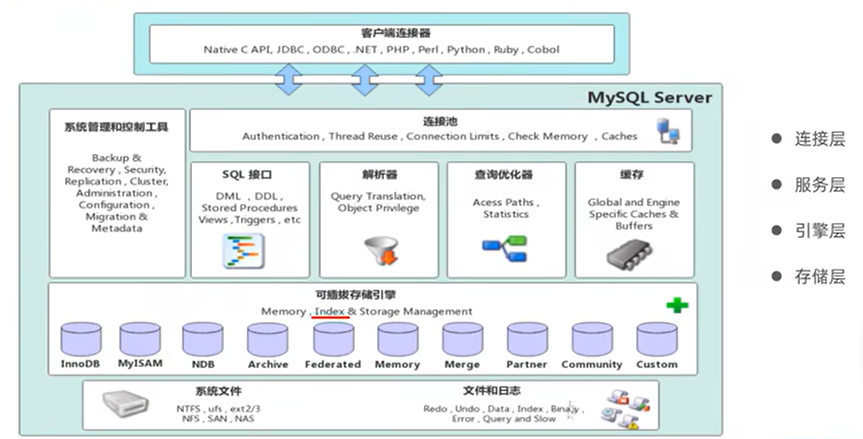
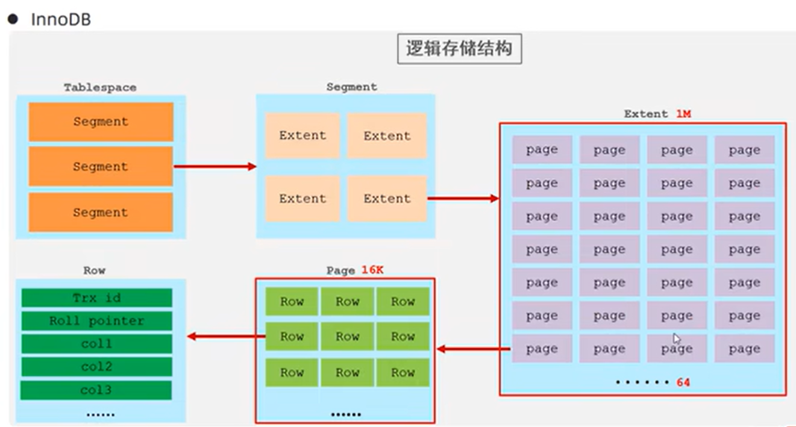
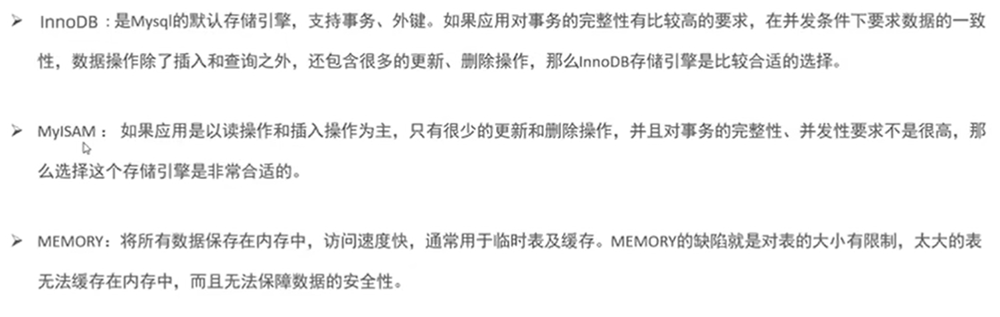
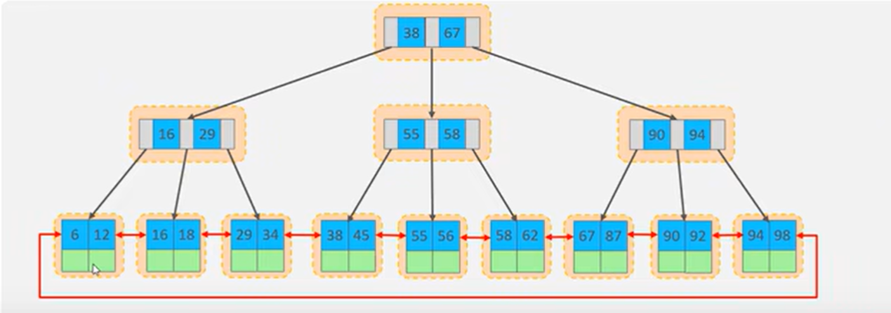

### 存储引擎

#### MySQl体系结构

#### 存储引擎简介

* 存储数据、建立索引、更新查询数据的实现方式
* 基于表
* 默认InnoDB引擎
* 创建表的时候指定引擎``engine=InnoDB``

#### 存储引擎特点

* InnoDB
  支持事务、行级锁、外键
  逻辑存储结构：
* MyISAM
  支持表锁，不支持行锁、事务、外键
* Memory
  存储在内存中，只能作为临时表或缓存
  hash索引

#### 存储引擎选择

### 索引

#### 索引概述

高效获取数据的数据结构

#### 索引结构

不同的存储引擎有不同的索引结构

* B+Tree索引 大部分引擎都支持
* Hash索引 InnoDB不支持
* R-tree 空间索引
* Full-text 全文索引--倒排索引

##### B+树索引

* 二叉树缺点：顺序插入容易形成一个链表，且大数据量下层级很深
* 红黑树缺点：本质还是二叉树，大数据量下层级深
* B树(多路平衡查找树)缺点：叶子节点和非叶子节点均储存数据，导致一页中存储的键值减少，增加树高度
* B+树 均在叶子节点上，且添加指针

**MySQL里的B+树**
增加了优化

##### Hash索引

通过hash算法计算值映射
InnoDB不支持hash索引，但有自适应功能，指定条件下根据B+索引自动创建
**只支持等值匹配，不支持范围匹配及排序**--所以选择B+树索引

#### 索引分类

* 主键索引
* 唯一索引
* 常规索引
* 全文索引

#### 索引语法

#### SQL性能分析

#### 索引使用

#### 索引设计原则