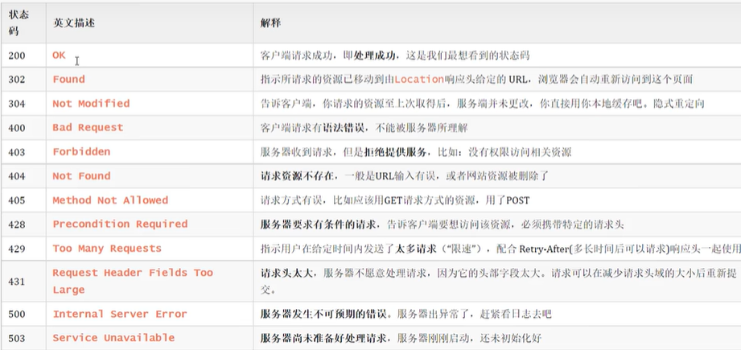

# 基础语法

updating...

# 面向对象

updating...

# API

## 常用API(一)

## 常用API(二)

### Object类
所有类的对象都可以用，默认继承

```java
public String toString(){//默认输出地址,主要用于子类重载方法，返回具体内容
     return ...;
}
public boolean equals(Object o){//默认比较地址（==），重载比较内容
     return ...;//1.比较地址2.null||比较类型 getClass()3.比较成员
}
public Object clone(){//需要标记接口 implements Cloneable
     return super.clone();//子类重载，抛出异常
}
```

#### 浅克隆/深克隆

浅拷贝：堆内存中拷贝地址
深拷贝：数据直接拷贝，字符串拷贝地址（字符串常量池），其他对象则创建新对象-----重载

#### 一些静态方法

```java
Objects.equals(s1,s2);//相比字符串的equals方法（注意空指针异常），先进行非空判断
Objects.isNull(s1);//s1==null
Objects.nonNull(s1);
```

---

### 包装类

把基本数据类型包装成对象
